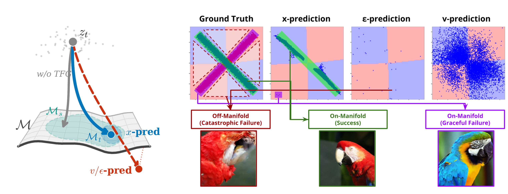

# Not All Prediction Targets Keep Training-Free Diffusion Guidance on the Manifold

**The diffusion prediction target (x, ε, or v) decides whether training-free guidance fails *gracefully* or *catastrophically*. x-prediction keeps guided samples on the data manifold; ε-prediction does not.**

[](#citation)
[](LICENSE)

[**arXiv**](https://arxiv.org/abs/2607.00647) &nbsp;·&nbsp; [**Project Page**](https://ManLuML.github.io/on-manifold-tfg) &nbsp;·&nbsp; [**Code**](https://github.com/ManLuML/on-manifold-tfg)

> Authors: **Yunsung Lee**, **Hyeongmin Lee**

---

<p align="center">
  
</p>

**Figure 1.** **(a)** Without guidance, all targets denoise z<sub>t</sub> onto the source class 𝓜<sub>s</sub> ⊂ 𝓜. With TFG, x-prediction slides along 𝓜 to the target class 𝓜<sub>t</sub>; v/ε-prediction departs 𝓜. **(b)** Crossed-lines (D=512, top) and ImageNet (bottom): x-prediction preserves structure; ε-prediction collapses off-manifold with catastrophic artifacts.

---

## Abstract

Training-free guidance (TFG) steers diffusion models without retraining, but strong guidance risks driving samples off-manifold. The resulting catastrophic failures (collapsed, artifact-ridden images) differ from graceful failures, where guidance misses the target but images remain realistic. We trace this distinction to the prediction target: all TFG methods compute guidance from a clean-data estimate x̂, so its fidelity governs manifold preservation. We prove a strict error amplification hierarchy: ε-prediction's recovery formula divides by *t*, amplifying errors unboundedly at high noise; v-prediction incurs bounded amplification; x-prediction incurs none. On ImageNet 256×256, we evaluate four pretrained Diffusion Transformers spanning all three targets. At matched classifier accuracy, guided-class FID (Child FID) reveals a 5.2-point gap between x- and ε-prediction (**32.9** vs. **38.1**): manifold damage invisible to standard evaluation. This extends to style transfer, establishing x-prediction as the target that keeps guidance failures graceful rather than catastrophic.

---

## Installation

This release is **self-contained** — no Git submodules. We use [`uv`](https://docs.astral.sh/uv/) for dependency management.

```bash
git clone https://github.com/ManLuML/on-manifold-tfg.git
cd on-manifold-tfg
uv sync
```

All commands below are run with `uv run python ...` from the repository root. The code is **evaluation/inference only** — no model training is shipped, and the four main diffusion models are used pretrained.

---

## Pretrained Models

The paper evaluates four pretrained Diffusion Transformers that span all three prediction targets at comparable unconditional quality (CFG-only FID ≈ 2 on ImageNet 256×256):

| Model | Prediction target | Space | Sampler | CFG-only FID ↓ |
|-------|:-----------------:|:-----:|:-------:|:--------------:|
| **JiT-H/16** | x | Pixel | Heun | **1.86** |
| **PixelFlow-XL** | v | Pixel | Euler (per-stage) | 1.98 |
| **SiT-XL/2** | v | Latent | Heun | 2.06 |
| **DiT-XL/2** | ε | Latent | DDPM | 2.27 |

Two inference configurations appear in the paper (Appendix C, *Inference hyperparameters*), and `experiments/model_configs.json` ships the first as the per-model default:

- **CFG-only baselines** use each model's published lowest-FID configuration — DiT 250-step DDPM, SiT 125-step Heun (NFE 250), JiT 50-step Heun (NFE 100), PixelFlow 30-step × 4-stage Euler (NFE 120). These are the defaults.
- **All guided experiments** standardize to NFE ≈ 100 — DiT 100-step DDPM and SiT 50-step Heun (pass `--nfe 100`); JiT and PixelFlow already match at their defaults.

> **Checkpoints** point at each model's official source. SiT / PixelFlow download via the helper script, DiT auto-downloads on first use, and **JiT-H/16 is a manual download** from the original authors' repo (see below). Expected local paths:
>
> | Model | Local checkpoint path | Source |
> |-------|-----------------------|--------|
> | JiT-H/16 | `checkpoints/jit/jit-h-16.pth` | [`LTH14/JiT`](https://github.com/LTH14/JiT) — official weights (Dropbox), manual download |
> | DiT-XL/2 | `checkpoints/dit/DiT-XL-2-256x256.pt` | `facebook/DiT-XL-2-256` |
> | SiT-XL/2 | `checkpoints/sit/SiT-XL-2-256.pt` | official SiT release |
> | PixelFlow-XL | `checkpoints/pixelflow/` | `ShoufaChen/PixelFlow-Class2Image` |
>
> See [`CHECKPOINTS.md`](CHECKPOINTS.md) for the per-model download instructions.

The two classifiers used by the bird benchmark (a guidance classifier and a separate validity classifier — kept separate to avoid circular evaluation) are pulled from the HuggingFace Hub on first run.

---

## Reproduce the Paper

All experiment entry points live in `experiments/` and `spiral_test/`. Each `experiments/` script writes images, a `config.json`, and a `metrics.json` under `outputs/`, and is resumable — re-invoking a command skips already-generated images and cached metrics. (`spiral_test/` manages its own outputs under `spiral_test/output/`.)

The headline guidance study is a **DPS ρ-sweep** (rho-only guidance): sweep `--rho_override` to trace the Pareto frontier. The appendix additionally verifies the same hierarchy under **LGD** and **FreeDoM** guidance (`--guidance_mode lgd` / `freedom`).

| Paper result | Command | Notes |
|--------------|---------|-------|
| **Fine-grained bird — C-FID / Validity ρ-sweep** (abstract headline: Child-FID **32.9** (x) vs. **38.1** (ε) at matched classifier accuracy — the 5.2-point gap; Fig. `rho_fid_vs_child_fid`, `rho_fid_vs_validity`) | `uv run python experiments/finegrained_bird_tfg.py --model jit-h-16 --guidance_mode dps --rho_override <ρ>`<br>`uv run python experiments/finegrained_bird_tfg.py --model dit --nfe 100 --guidance_mode dps --rho_override <ρ>` | Sweep `<ρ>` (e.g. `0.1 0.3 0.5 ...`), 143 species × 64 samples per point. Guided runs use the paper's NFE ≈ 100 setup: pass `--nfe 100` for `dit` (100-step DDPM) and `sit` (50-step Heun); `jit-h-16` (Heun, x-space) and `pixelflow` need no override. |
| **Bird — TFG-family robustness (appendix)** (same ordering under LGD / FreeDoM; Fig. `bird_lgd_*`) | `uv run python experiments/finegrained_bird_tfg.py --model jit-h-16 --guidance_mode lgd --mu_override <μ>` | LGD is μ-only (MC smoothing, ρ=0): sweep `--mu_override`. FreeDoM sweeps `--rho_override` as in DPS. Same NFE rule as above. |
| **Fine-grained bird — CFG-only baseline** (zero-guidance reference point) | `uv run python experiments/finegrained_bird_no_guidance.py --model jit-h-16` | One run per model (`jit-h-16`, `dit`, `sit`, `pixelflow`); the `--nfe 100` rule for `dit`/`sit` applies here too (all bird results use the NFE ≈ 100 protocol). |
| **Inverse problems — Gaussian deblur (appendix)** | `uv run python experiments/deblur_sr.py --task deblur --model jit-h-16 --guidance_mode dps --rho_override <ρ> --imagenet_dir <path/to/imagenet/val>` | Reports LPIPS / PSNR / SSIM. Swap `--model dit` etc. (`--nfe 100` rule applies). The appendix sweeps model-specific ρ (up to 16); omitting `--rho_override` runs the preset ρ=1. Defaults generate 1,000 images; the paper reports metrics on a 100-image subset, so exact values may differ slightly. |
| **Inverse problems — 4× super-resolution (appendix)** | `uv run python experiments/deblur_sr.py --task super_resolution --model jit-h-16 --guidance_mode dps --rho_override <ρ> --imagenet_dir <path/to/imagenet/val>` | Same metrics as deblur; appendix sweeps ρ up to 32 (preset ρ=4 without the override). |
| **CFG-only baseline — 4 models, FID/IS** (Table 1; JiT-H 1.86 · PixelFlow 1.98 · SiT 2.06 · DiT 2.27) | `uv run python experiments/imagenet_no_guidance.py --model jit-h-16` | One run per model at the published-optimum defaults (no `--nfe` override). Defaults to 1000 classes × 50 images = 50K samples. |
| **Crossed-lines manifold ablation** (2D → 512D; `onmanifold_vs_dim`) | `uv run python spiral_test/generate_data.py --name crossed_lines`<br>`uv run python spiral_test/train.py --data crossed_lines`<br>`uv run python spiral_test/inference.py --exp crossed_lines_<YYYYMMDD_HHMMSS> -s 10.0 -n 100` | Toy x/ε/v ablation across dimensions D ∈ {2, 8, 32, 128, 512}; self-contained, trains tiny MLPs from scratch. Paper setting: DPS strength `s=10`, 100 Euler steps, 10,000 samples. See [`spiral_test/README.md`](spiral_test/README.md). |

Useful shared flags for the `experiments/` scripts: `--nfe` and `--sampling_method` (override the per-model defaults), `--images_per_class`, `--batch_size`, `--device`, `--seed`, `--force_rerun`. The bird scripts also accept `--skip_fid` (validity only). Run any script with `--help` for the full list.

> **Style transfer (CLIP-Gram)** is reported in the paper (`style_gram_vs_validity.png`) but the style-transfer code is **not** part of this release.

### FID reference statistics

FID/Child-FID computation needs precomputed Inception reference statistics, which are **not committed** to the repository. Fetch them with:

```bash
uv run python scripts/download_fid_stats.py
```

This populates `src/jit_tfg/evaluation/generation/fid_stats/` (`imagenet/in256_stats.npz`, `finegrained/{parent,child}_fid_stats.npz`). The stats are hosted on the HuggingFace Hub dataset repo [`ManLuML/onmanifold-tfg-fid-stats`](https://huggingface.co/datasets/ManLuML/onmanifold-tfg-fid-stats) and fetched automatically by the script. Until you download the stats, runs without these files print a warning and report FID as `0.0`; validity and IS are unaffected.

Each `.npz` holds `mu` (2048,) and `sigma` (2048, 2048) Inception-V3 pool3 features over the following reference sets:

| File | Metric | Reference distribution |
|------|--------|------------------------|
| `finegrained/child_fid_stats.npz` | Child-FID (C-FID) | the 143 benchmark bird species — 64 train images per species, seed 42 (9,152 images) |
| `finegrained/parent_fid_stats.npz` | Parent-FID (P-FID) | the 30 ImageNet bird parent classes, class-balanced (9,152 images) |
| `imagenet/in256_stats.npz` | CFG-only FID on ImageNet 256×256 | ImageNet-1K 256×256, as distributed with the official JiT release |

These are the exact reference sets behind every number in the paper. Where the paper's prose describes them more broadly — C-FID against "the full bird species dataset", P-FID against "the full ImageNet marginal" — the table above is the precise specification.

`imagenet/in256_stats.npz` is byte-identical to `fid_stats/jit_in256_stats.npz` from [LTH14/JiT](https://github.com/LTH14/JiT) (MIT License, © 2025 Tianhong Li), redistributed unchanged so that ImageNet FID is measured against the same reference as the JiT baselines. The fine-grained statistics are ours.

### Benchmark datasets

The two fine-grained benchmarks from the paper are released as standalone HuggingFace datasets. Each pairs the source images with the parent–child hierarchy that defines the benchmark, and ships its mapping JSON alongside.

| Dataset | `benchmark` config | `full` config |
|---|---|---|
| [**Bird**](https://huggingface.co/datasets/ManLuML/onmanifold-tfg-bird-benchmark) — 143 species under 30 ImageNet parents | 24,439 images / 143 species | 89,885 / 525 (complete source snapshot) |
| [**Butterfly**](https://huggingface.co/datasets/ManLuML/onmanifold-tfg-butterfly-benchmark) — 34 species under 6 ImageNet parents | 4,781 / 34 | 13,594 / 100 |

```python
from datasets import load_dataset

ds = load_dataset("ManLuML/onmanifold-tfg-bird-benchmark", "benchmark", split="train")
ds[0]["label_name"], ds[0]["imagenet_parent_name"]   # ('ABYSSINIAN GROUND HORNBILL', 'hornbill')
```

Use `benchmark` for the generation targets; `full` is the complete upstream snapshot the subset was drawn from. Label indices are shared between the two configs and match `experiments/finegrained_bird_mapping.json` in this repository. Both datasets are CC0, inherited from Gerald Piosenka's source data.

---

## Repository Structure

```
on-manifold-tfg/
├── src/jit_tfg/                  # Python package (import name: jit_tfg)
│   ├── tfg/                      # UnifiedSampler + TFG guiders + config/calibration
│   │   ├── unified_sampler.py    # Unified x/ε/v sampling + guidance injection
│   │   └── guiders/              # base, finegrained, imagenet, inverse guiders
│   ├── models/                   # 4 model wrappers
│   │   ├── jit/                  # JiT  (x-prediction, pixel space)
│   │   ├── dit/                  # DiT  (ε-prediction, latent space + VAE)
│   │   ├── sit/                  # SiT  (v-prediction, latent space)
│   │   └── pixelflow/            # PixelFlow (v-prediction, pixel space)
│   └── evaluation/               # FID/IS + classification validity
│       ├── generation/           # Inception features, FID, IS, stats paths
│       └── guidance/             # ImageNet + fine-grained bird validity evaluators
├── experiments/                  # Paper experiment entry points
│   ├── finegrained_bird_tfg.py         # Bird C-FID / Validity ρ-sweep (headline; DPS + LGD/FreeDoM)
│   ├── finegrained_bird_no_guidance.py # Bird CFG-only baseline
│   ├── deblur_sr.py                    # Inverse problems: deblur + 4× SR
│   ├── imagenet_no_guidance.py         # CFG-only FID/IS for 4 models
│   └── utils.py
├── spiral_test/                  # Crossed-lines 2D→512D toy manifold ablation
├── scripts/                      # download_checkpoints.py · download_fid_stats.py
├── tests/                        # Unit tests (sampler, models, schedules, …)
├── docs/                         # concepts/ · getting-started/ · evaluation/
├── assets/                       # README figures
├── pyproject.toml · uv.lock · Makefile · .pre-commit-config.yaml
└── LICENSE · CONTRIBUTING.md · THIRD_PARTY_LICENSES.md
```

> The experiment scripts also expect three small data files in `experiments/` — `model_configs.json` (per-model checkpoint paths, samplers, NFE, CFG scale), `finegrained_bird_mapping.json` (fine-grained-species → ImageNet-parent class mapping), and `imagenet_class_index.json` (standard ImageNet class index, used by the deblur/SR script). The deblur/SR script additionally needs a local ImageNet validation set, passed via `--imagenet_dir`.

---

## Citation

```bibtex
@inproceedings{lee2026onmanifold,
  title     = {Not All Prediction Targets Keep Training-Free Diffusion Guidance on the Manifold},
  author    = {Lee, Yunsung and Lee, Hyeongmin},
  booktitle = {European Conference on Computer Vision (ECCV)},
  year      = {2026}
}
```

---

## License

This project is released under the [MIT License](LICENSE) © Yunsung Lee and Hyeongmin Lee.

It builds on several upstream projects with their own terms (JiT, DiT, SiT, PixelFlow, TFG, InverseBench, EDM). See [`THIRD_PARTY_LICENSES.md`](THIRD_PARTY_LICENSES.md) for full attribution. **Note:** the DiT components derive from Meta's DiT, which is licensed **CC-BY-NC 4.0 (non-commercial)** — that restriction applies to the DiT-derived code (`src/jit_tfg/models/dit/`) regardless of the top-level MIT license.
