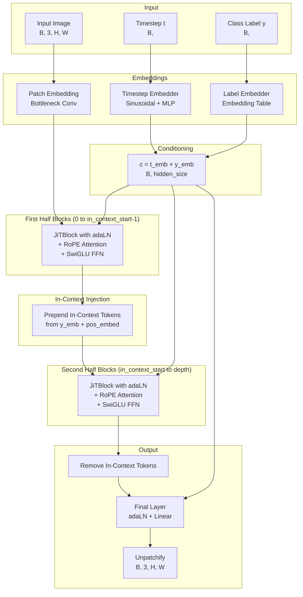
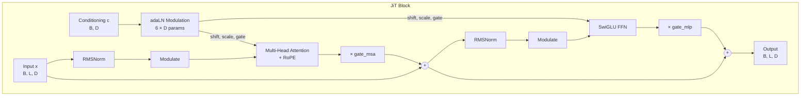

# Architecture

This document describes the JiT (Just image Transformer) architecture and its key components.

## Overview

JiT is a transformer-based diffusion model designed for high-quality image generation. The architecture combines several modern techniques:

1. **Bottleneck Patch Embedding**: Two-stage convolution for efficient patch embedding
2. **Adaptive Layer Normalization (adaLN)**: Dynamic feature adjustment based on conditioning
3. **Rotary Position Embedding (RoPE)**: 2D spatial position encoding
4. **In-Context Conditioning**: Class tokens injected partway through the network
5. **SwiGLU FFN**: Swish-gated linear units for improved feed-forward networks

## Complete Architecture



## Key Components

### Bottleneck Patch Embedding

The patch embedding uses a two-stage convolution approach for efficiency:

```
Input:  (B, 3, H, W)
           │
           ▼
Conv2d (patch_size kernel) → (B, pca_dim, H/P, W/P)
           │
           ▼
Conv2d (1x1 kernel) → (B, embed_dim, H/P, W/P)
           │
           ▼
Flatten + Transpose → (B, num_patches, embed_dim)
```

This design reduces computation while preserving important features by first reducing to a bottleneck dimension (typically 128) before expanding to the full embedding dimension.

### Timestep Embedding

Timesteps are embedded using sinusoidal encoding followed by an MLP:

```
t (B,) → Sinusoidal Encoding → (B, freq_dim)
                    │
                    ▼
            Linear → SiLU → Linear → (B, hidden_size)
```

The sinusoidal encoding follows the Transformer positional encoding formula:

\\[
PE(t, 2i) = \sin(t / 10000^{2i/d})
\\]
\\[
PE(t, 2i+1) = \cos(t / 10000^{2i/d})
\\]

### Adaptive Layer Normalization (adaLN-Zero)

Each transformer block uses adaLN-Zero modulation, which provides fine-grained conditioning control:

```
c → MLP → (shift_msa, scale_msa, gate_msa, shift_mlp, scale_mlp, gate_mlp)
```

The modulation is applied as:

\\[
\text{output} = x \cdot (1 + \text{scale}) + \text{shift}
\\]

The gates are initialized to zero, allowing residual connections to dominate early in training:

\\[
x' = x + \text{gate} \cdot \text{Attention}(\text{modulate}(\text{Norm}(x)))
\\]

### Rotary Position Embedding (RoPE)

2D RoPE encodes spatial positions in the attention mechanism:

- Separate frequency components for height and width
- Applied via element-wise multiplication with cos/sin terms
- Enables relative position awareness

```python
# Apply rotation: x * cos(θ) + rotate_half(x) * sin(θ)
x_rotated = x * freqs_cos + rotate_half(x) * freqs_sin
```

### In-Context Conditioning

Class information is injected as learnable tokens partway through the network:

```
At block in_context_start:
    in_context = y_emb.repeat(1, in_context_len, 1) + in_context_posemb
    x = concat([in_context, x])

After final block:
    x = x[:, in_context_len:]  # Remove in-context tokens
```

This provides enhanced conditioning by allowing attention between image patches and class tokens.

### SwiGLU Feed-Forward Network

The FFN uses SwiGLU activation for improved performance:

\\[
\text{SwiGLU}(x) = \text{SiLU}(W_1 x) \odot (W_2 x)
\\]
\\[
\text{output} = W_3 \cdot \text{SwiGLU}(x)
\\]

The hidden dimension is reduced to 2/3 of the standard 4× expansion to match parameter count.

## JiT Transformer Block



## Model Configurations

| Model | Depth | Hidden Size | Heads | MLP Ratio | In-Context Start | Parameters |
|-------|-------|-------------|-------|-----------|------------------|------------|
| JiT-B/16 | 12 | 768 | 12 | 4.0 | 4 | ~86M |
| JiT-B/32 | 12 | 768 | 12 | 4.0 | 4 | ~86M |
| JiT-L/16 | 24 | 1024 | 16 | 4.0 | 8 | ~307M |
| JiT-L/32 | 24 | 1024 | 16 | 4.0 | 8 | ~307M |
| JiT-H/16 | 32 | 1280 | 16 | 4.0 | 10 | ~632M |
| JiT-H/32 | 32 | 1280 | 16 | 4.0 | 10 | ~632M |

### Patch Size Trade-offs

- **Patch size 16**: More patches → finer detail, higher compute
- **Patch size 32**: Fewer patches → faster training, less spatial detail

## Tensor Shapes

Key tensor dimensions throughout the forward pass:

| Location | Shape | Description |
|----------|-------|-------------|
| Input image | `(B, 3, H, W)` | RGB image |
| After patch embed | `(B, N, D)` | N = (H/P)×(W/P) patches |
| Timestep embedding | `(B, D)` | Conditioning |
| Class embedding | `(B, D)` | Conditioning |
| After in-context | `(B, N+K, D)` | K in-context tokens added |
| Before final layer | `(B, N, D)` | In-context tokens removed |
| Final output | `(B, 3, H, W)` | Same as input |

Where:
- `B` = Batch size
- `H, W` = Image height, width
- `P` = Patch size (16 or 32)
- `N` = Number of patches
- `D` = Hidden dimension
- `K` = In-context length (default 32)

## Initialization Strategy

The model uses careful initialization for stable training:

| Component | Initialization |
|-----------|----------------|
| Linear layers | Xavier uniform |
| Positional embeddings | Fixed sin-cos |
| Patch embedding convs | Xavier uniform |
| Label embeddings | Normal(0, 0.02) |
| adaLN outputs | Zero |
| Final layer | Zero |

Zero initialization of adaLN and final layer outputs enables residual connections to dominate initially, improving training stability.

## Dropout Strategy

Dropout is applied selectively to the middle 50% of blocks:

```python
# Only apply dropout to blocks in [depth//4, depth*3//4)
attn_drop = dropout_rate if (depth//4 <= i < depth*3//4) else 0.0
```

This empirically improves performance by:
- Maintaining stable gradients in early layers
- Providing regularization in the middle layers
- Preserving capacity in the final layers

## Next Steps

- [Research Context](research-context.md): Understand the research goals
- [Denoiser API](../api/denoiser.md): Training and sampling wrapper
- [Model API](../api/model.md): JiT model implementation details
