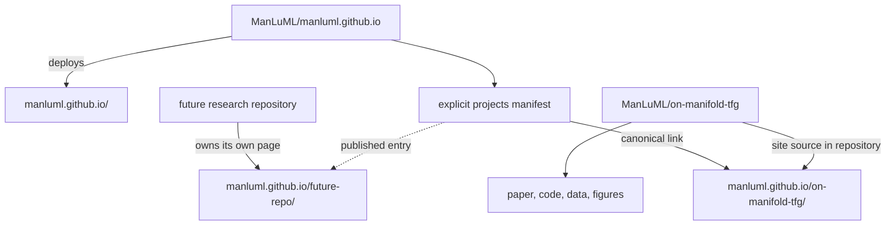

# ManLuML research site and On-Manifold TFG project page plan

- Status: approved implementation baseline
- Date: 2026-09-01
- Implementation: not started

## Implementation addendum — final affiliation treatment

On 2026-09-01, the user explicitly superseded the affiliation-logo requirements in this baseline. The new production project page uses text-only affiliations and generates no MAUM.AI or SeoulTech logo derivatives. The visible affiliations are “Maum AI” and “Seoul National University of Science and Technology,” with country labels omitted. A slide deck published independently on the legacy deployment while this implementation was in progress is preserved at immutable tag `legacy-pages-pre-astro-2026-09-01`. Its stable `/slides/` route remains a minimal recovery page linking that snapshot, without republishing the deck’s excluded third-party quotations, fonts, or institution artwork. This addendum overrides every earlier requirement that either official mark appear on the new page; all other requirements remain in force.

The implementation replaces the ambiguous public shorthand `x < v < ε` with an explicit TFG robustness ranking: x-prediction first, v-prediction second, and ε-prediction third, labeled from most to least robust. Camera-ready Figure 1(a) replaces the hand-built manifold path drawing, and visible formulas use balanced deterministic HTML/CSS typesetting with accessible MathML retained. The venue remains the text label “ECCV 2026”; the official navbar SVG is excluded because no current written republication grant for an independent project site was verified.

## 1. Outcome

Build two coordinated, English-only GitHub Pages experiences:

1. A deliberately minimal ManLuML organization home at `https://manluml.github.io/`.
2. A complete rebuild of the existing project page at `https://manluml.github.io/on-manifold-tfg/`, preserving that public URL.

The first release should make the paper unusually easy to understand and verify while establishing a repeatable way to publish future ManLuML research. It must not create empty team, publication, or future-project sections merely to look larger than the organization currently is.

## 2. Product principles

- **Curiosity, joy, contribution.** The home manifesto is: “Curiosity starts it. Joy drives it. Contribution gives it meaning.”
- **Research collective first.** ManLuML is the publishing identity. Authors and their formal institutional affiliations remain project facts, not co-brands for the organization.
- **Layered explanation.** A new visitor should understand the claim in about 30 seconds; a specialist should be able to continue into equations, controls, limitations, and full evidence.
- **Interaction must explain.** Add only two focused interactions, each with a complete static and accessible fallback.
- **Explicit publication.** A project appears on the organization home only when it is intentionally registered as published. Never crawl local folders or the GitHub organization for content.
- **Stable public links.** Existing canonical URLs survive redesigns and framework changes.
- **Claims follow the camera-ready paper.** Presentation copy is useful for narrative structure, but it is not an authority when it conflicts with the final paper.

## 3. Confirmed decisions

| Area | Decision |
| --- | --- |
| Ownership | Hybrid: the organization repository owns the root home; each research repository owns and deploys its own project page. |
| Project discovery | A checked-in, explicit project manifest; no automatic repository discovery. |
| Existing project page | Preserve `/on-manifold-tfg/`, but rebuild it from the ground up. |
| Shared system | Validate the first one or two sites as a template, then extract a shared package only after repeated needs are proven. |
| Language | Strict full-English policy for every public ManLuML artifact: interface, prose, documentation, metadata, repository guidance, and release material. Korean may be used in private working conversations only. |
| Organization name | `ManLuML`. |
| Organization identity | A research collective that follows interesting questions across fields and aims to turn curiosity and enjoyment into meaningful contribution. |
| Organization home | Minimal link home; its primary action is to open the featured research. |
| Brand | Properly redesign the existing yellow-face character as a simple mascot. Do not create many variations in the first release. |
| Color architecture | Warm mascot yellow and ink for the ManLuML shell; each project owns an accent palette. On-Manifold TFG uses the deck's navy/cyan language, with red reserved for failure. |
| Project audience | Layered: approachable first, expert-depth later. |
| Project interaction | Two focused explainers: prediction-target error amplification and a result comparison explorer. |
| Author display | Use full camera-ready author, affiliation, equal-contribution, and corresponding-author information. |
| Affiliation marks | Use each user-provided official MAUM.AI and SeoulTech logo exactly once in the project hero's authorship/affiliation treatment. Keep them subordinate to ManLuML; do not place them on the organization home, shared shell, navigation, favicon, social cards, footer, or reusable template. |
| Primary resources | Paper, Code, Data, Cite. |
| Slides | Out of scope for the first release; use the deck only as an internal narrative and visual reference. |
| Analytics | None in the first release. |

## 4. Confirmed technical and release defaults

The following were approved as implementation decisions:

- Astro, TypeScript, MDX, and schema-validated content collections.
- Static HTML by default; native TypeScript islands only for the two explainers.
- GitHub Actions for checks and Pages deployment from each repository's default branch.
- `manluml.github.io` and `/on-manifold-tfg/` remain the canonical URLs. Keep the site origin configurable so a later domain change is mechanical.
- Coordinate the root home and rebuilt project page as one public release, with two independent deploys and independent rollback.
- Keep this document in the current paper repository until the organization-site repository exists; copy or link it from the new repository at implementation kickoff.

## 5. Current state

- `https://manluml.github.io/` currently returns 404; the organization-site repository does not exist publicly.
- `https://manluml.github.io/on-manifold-tfg/` is live from the research repository's `gh-pages` branch.
- The live page already has a canonical URL, social metadata, WebP fallbacks, meaningful alternative text, and BibTeX copying. Those are regression baselines, not an architectural foundation.
- The current source is one hand-written Bulma/MathJax HTML page with CDN dependencies and no build, schema, link, accessibility, or deployment checks.
- The live URL is already linked from the repository and arXiv-facing materials, so changing it creates avoidable SEO and citation risk.
- The public organization currently has one research repository. The first home must not imply nonexistent projects or members.

## 6. Repository and URL architecture



### Organization repository

Create `ManLuML/manluml.github.io` with:

```text
src/
  content/projects/*.yaml
  components/
  layouts/
  pages/index.astro
  styles/tokens.css
public/
  brand/
  og/
```

The root site has no project-detail copies. It renders curated links and summaries from its manifest.

### Research repository

Keep the On-Manifold TFG website source in its research repository, preferably under an isolated `site/` directory so the Python project and website retain independent dependency graphs:

```text
site/
  src/content/project.yaml
  src/content/page.mdx
  src/components/interactive/
  src/pages/index.astro
  src/styles/
  public/media/
```

Configure Astro with `site: "https://manluml.github.io"` and `base: "/on-manifold-tfg"`. All internal links and assets must be base-aware.
Fix the trailing-slash policy to `always` so canonical, sitemap, and internal URLs agree.

### Project registry

The organization manifest should require at least:

```yaml
schemaVersion: 1
slug: on-manifold-tfg
title: Not All Prediction Targets Keep Training-Free Diffusion Guidance on the Manifold
tagline: ...
venue: ECCV 2026
year: 2026
status: published
published: true
featured: true
canonicalUrl: https://manluml.github.io/on-manifold-tfg/
repositoryUrl: https://github.com/ManLuML/on-manifold-tfg
topics: [...]
thumbnail: ...
ogImage: ...
links:
  paper: ...
  code: ...
  data: [...]
datePublished: ...
dateModified: ...
provenanceReviewed: true
```

The build must reject duplicate slugs, missing required links, invalid URLs, and `published: true` entries without reviewed provenance. Draft and private research never enters the manifest.

## 7. ManLuML home

The home is one short page, not a miniature institutional site.

### First viewport

- Redesigned mascot, `ManLuML` wordmark, and the three-line manifesto.
- One sentence clarifying that ManLuML is a research collective that follows interesting questions across fields.
- A single, dominant `Explore the research` action leading to On-Manifold TFG.

### Below the fold

- One featured-project card with title, ECCV 2026, one-sentence claim, a strong author-owned image, and Paper/Code links.
- A quiet link to the ManLuML GitHub organization.
- A compact footer with no newsletter, analytics, fabricated social accounts, team roster, or unused navigation.

When a second public project is registered, add a real projects index. Until then, do not ship an empty `/projects/` route.

## 8. Mascot and design system

### Mascot scope

- Preserve the recognizable yellow-face idea, but redraw it cleanly rather than upscaling the current raster avatar.
- Deliver an SVG master, transparent PNG exports, favicon sizes, one small monochrome fallback, and one social-card-safe composition.
- First release usage: home, favicon, 404 treatment, and a small return-to-ManLuML mark on project pages.
- Do not create a cast of characters, multiple poses, or an animation library yet.

### Visual hierarchy

- **Organization shell:** warm yellow, near-black ink, off-white paper, restrained borders, and playful but sparse mascot moments.
- **On-Manifold TFG:** Inter-like scientific editorial typography, generous white space, navy `#0D47A1`, cyan `#0891B2`, ink `#0A0E1A`, muted slate, and red only for amplified error or off-manifold failure.
- The official MAUM.AI and SeoulTech marks appear as compact affiliation identifiers beside the corresponding author information. They support authorship; they do not become ManLuML co-brands or compete with the paper title.
- Preserve each mark's official geometry, aspect ratio, colors, and clear space. Do not recolor, stretch, combine, animate, or generatively redraw either logo.
- Keep full textual affiliations in accessible HTML and link author names to their profiles; logos never replace names or affiliation text.
- Institution colors stay inside the official artwork and do not become ManLuML or project design tokens.
- Motion is brief and explanatory, respects `prefers-reduced-motion`, and never gates content.

### Official affiliation logo references

- SeoulTech official logo and color reference: `docs/assets/brand-references/seoultech-official-logo-and-colors.png` (581x258, RGB).
- MAUM.AI official transparent wordmark: `docs/assets/brand-references/maum-ai-official-wordmark.png` (1804x375, RGBA).
- The SeoulTech input is a composite reference containing the mark and its color guide. Create a deterministic, pixel-faithful production crop of only the left logo/wordmark region and display it on a white or light-neutral surface. Do not publish the color-guide panel as part of the affiliation mark.
- For MAUM.AI, trim only fully transparent outer canvas. Preserve alpha, geometry, color, and aspect ratio.
- Prefer lossless PNG derivatives. Do not autotrace, upscale, add effects, or otherwise reinterpret either mark. A verified official vector may replace a raster derivative only when its provenance and exact identity are recorded.
- Optimize production derivatives without overwriting the supplied originals. Record original and derivative hashes, dimensions, deterministic crop/trim parameters, optimization, owner, intended placement, and verification date in the asset ledger.
- Treat both marks as institution trademarks supplied for factual affiliation display. Do not include them in the site's general code/content license.

## 9. On-Manifold TFG page structure

### 1. Hero

- ECCV 2026 label and full paper title.
- Yunsung Lee¹* and Hyeongmin Lee²*†.
- Full affiliations: MAUM.AI, Republic of Korea; Seoul National University of Science and Technology, Republic of Korea.
- After the textual affiliations and before the resource actions, show a quiet affiliation strip mapping MAUM.AI to `¹` and SeoulTech to `²`.
- Size the two official marks by balanced optical weight rather than equal forced width. The strip must wrap cleanly at 320px, while readable institution text remains present at every viewport.
- A clear legend for equal contribution and corresponding author.
- Primary actions: Paper, Code, Data, Cite.
- `Data` opens the page's Resources section first; that section names and links the Bird, Butterfly, and FID-stat datasets separately instead of hiding several destinations behind one ambiguous external button.
- A compact ManLuML link that returns to the root home.

### 2. Thirty-second thesis

- Lead with the claim that prediction target determines whether training-free guidance fails gracefully or catastrophically.
- Show the author-owned teaser or a web-native reconstruction of its key geometry.
- Introduce the strict amplification order: `x < v < epsilon`.

### 3. The visible failure

- Present a synchronized x/v/epsilon result comparison using author-owned high-resolution grids.
- Explain graceful miss versus catastrophic off-manifold collapse before presenting aggregate metrics.
- Do not use an overlay drag control unless the compared images are genuinely registered counterparts. Otherwise use accessible tabs or a strength scrubber.

### 4. Interactive explainer: error amplification

- A keyboard-operable time/noise slider updates the three recovery-error coefficients.
- Display the formulas and a small manifold-path diagram together.
- Make the high-noise convention explicit: in the paper's parameterization, epsilon amplification `(1-t)/t` diverges as `t -> 0`; v remains bounded at `(1-t)`; x has no recovery amplification.
- Provide a non-interactive table and prose in the initial HTML so the result remains complete without JavaScript.

### 5. Controlled evidence

- Start with crossed-lines because it isolates prediction target most cleanly.
- Feature the D=512 on-manifold rates: x 93.3%, v 21.5%, epsilon 0.5%.
- Then explain the DiT/SiT and capacity-reversed controls that support attribution beyond the toy setting.

### 6. Real-image evidence

- Explain Child FID and why aggregate FID or classifier validity alone can hide manifold damage.
- At matched validity, report x/JiT-H 32.9, v/SiT 34.7, and epsilon/DiT 38.1; call out the x-versus-epsilon 5.2-point gap.
- State the benchmark scale: 143 species and 9,152 samples per point.
- Pair quantitative plots with nearby text or an accessible data table that states the trend and sample size.

### 7. Broader validation

Use a concise secondary section, not a wall of appendix figures:

- LGD and FreeDoM.
- Butterfly benchmark.
- Style transfer.
- Inverse problems.
- Precision/recall and mode-collapse evidence.

Each item should answer “does the hierarchy persist here?” and link to the paper or code for details.

### 8. Scope and limitations

- Explicitly distinguish controlled evidence from cross-model evidence.
- Never reuse the slide claim “Only the prediction target differs” for the pretrained bird-model comparison. Those models also vary in architecture and operating space.
- State that converging controls strengthen attribution without pretending every real-model comparison is perfectly isolated.

### 9. Resources and citation

- Paper link must resolve to the current arXiv PDF or proceedings PDF; remove the existing `#` placeholder.
- Code links to the repository.
- Data links to the published Bird, Butterfly, and FID-stat resources as appropriate.
- BibTeX is rendered in HTML and has an accessible copy action with visible success feedback.
- Slides are omitted from the first release.

## 10. Content and asset authority

Use sources in this order:

1. Camera-ready paper at submodule commit `22954ee` for claims, metadata, results, qualifications, and citation.
2. Public research repository for installation, code, data, and live artifact links.
3. Author-owned paper figures for publication assets.
4. User-provided official affiliation-logo references for MAUM.AI and SeoulTech marks.
5. The 2026 slide deck for pacing, progressive explanation, and project-specific visual language only.
6. The existing live page for URL, metadata, and accessibility regression checks only.

### Approved first-choice assets

- Teaser and crossed-lines figures.
- `rho_fid_vs_validity` and `rho_fid_vs_child_fid` plots.
- High-resolution JiT, DiT, SiT, and PixelFlow comparison grids.
- PRDC, style-transfer, LGD/FreeDoM, and butterfly figures when used in the secondary evidence section.

### Exclusions and provenance

- Do not use stale or non-final assets such as `rebuttal_delta_precision`, old root-level P-FID plots, or other figures absent from the final paper.
- DDPM and JiT paper crops in the presentation are third-party educational quotations. Redraw a concept with original geometry or omit it unless reuse rights are explicitly verified.
- Maintain an asset ledger containing origin, author, license, transformation, web derivative, alt text, and last verification date.
- Do not apply one blanket footer license. Separate website code, paper text/author figures, ManLuML brand assets, and third-party material.

## 11. Metadata and discoverability

Both deployments need:

- Unique title, description, absolute canonical, Open Graph, and social-card metadata.
- A 1200x630 ManLuML root card and a separate project card containing the paper title, venue, authors, and an author-owned visual crop.
- Sitemap, `robots.txt`, a useful 404 page, and stable favicons.
- Organization `WebSite`/`Organization` structured data on the root.
- Scholarly and citation metadata on the project page, including title, authors, year, venue, abstract, and authoritative PDF URL.
- No duplicate self-hosted paper PDF in the first release unless there is a deliberate Scholar-indexing or archival requirement.

## 12. Accessibility and performance contract

- Target WCAG 2.2 AA.
- Semantic landmarks and heading order, skip link, visible focus, keyboard-complete controls, 320 px reflow, reduced-motion behavior, and no color-only meaning.
- Every complex figure gets concise alt text plus nearby prose or a data table describing its important trend, values, and sample size.
- Both interactions have static fallbacks and are usable with keyboard and screen reader labels.
- Affiliation logos supplement visible institution names. When directly adjacent to the same text, use empty alternative text to prevent duplicate screen-reader announcements; if independently linked later, give the link one concise accessible name and verify its official destination.
- Pre-render math with accessible MathML rather than relying on a blocking MathJax CDN.
- Generate responsive AVIF/WebP derivatives from high-resolution sources while retaining an appropriate fallback.
- Reserve image dimensions to prevent layout shift; lazy-load below-fold media.
- Self-host required fonts and avoid runtime CDN dependencies.
- Performance targets at the 75th percentile: LCP at or below 2.5 s, INP at or below 200 ms, CLS at or below 0.1.
- Ship no analytics, cookies, database, or server runtime.

## 13. Implementation phases and review gates

When this plan is executed as an approved Codex Goal, the user's approval of the plan authorizes progress through every gate once its evidence checks pass. Gates require recorded verification, not routine pauses for user approval. Pause only for an irreconcilable factual conflict, unavailable required credential or permission, or an irreversible action outside this plan.

### Phase 0 - freeze the facts

- Start implementation from a fresh checkout of the then-current `origin/main`; the present local branch is five commits behind and must not be treated as the release baseline.
- Record the authoritative paper commit and public artifact URLs.
- Build the claim table and asset-provenance ledger.
- Register the two supplied official affiliation-logo originals, dimensions, checksums, trademark role, and permitted factual-placement purpose before deriving web assets.
- Snapshot the current page's metadata, links, and public assets for rollback and regression comparison.
- Inventory compatibility paths. Preserve or alias the existing `#abstract`, `#method`, `#results`, and `#bibtex` fragments, and audit externally usable `static/images/*` URLs before moving assets.

Gate: verify and record author metadata, headline claims, exact numbers, and exclusions against the camera-ready authority.

### Phase 1 - brand and content skeleton

- Redesign the simple mascot and define organization/project tokens.
- Prepare exact, optimized affiliation-logo derivatives and prototype the balanced authorship row at phone and desktop widths.
- Create the root first viewport and the project hero/30-second-thesis slice.
- Draft the complete English page outline before polishing prose.

Gate: visually review and record the mascot master, home first viewport, project hero, and narrative order against the approved design contract.

### Phase 2 - platform foundation

- Create the organization repository and explicit manifest schema.
- Add the isolated Astro site to the research repository.
- Add base-path-safe links, common metadata components, asset processing, and Actions workflows.

Gate: both sites build from clean checkouts; draft projects cannot appear on the root.

### Phase 3 - core project experience

- Implement the visible-failure section, amplification explorer, controlled evidence, and real-image evidence.
- Integrate final author-owned figures and accessible data descriptions.
- Complete Paper/Code/Data/Cite actions.

Gate: validate the two interactions and every scientific statement against the claim table.

### Phase 4 - completeness and quality

- Add broader validation, limitations, structured metadata, social cards, 404, sitemap, and license notices.
- Verify phone, tablet, desktop, keyboard, reduced-motion, and screen-reader paths.
- Run clean build, schema, link, accessibility, interaction, and performance checks.

Gate: complete and record staging review with no production-source switch.

### Phase 5 - coordinated launch and rollback window

- Publish the organization home first while it still links to the working legacy project page; verify the root independently.
- Switch the project repository's Pages source from the legacy output branch to the verified Actions artifact without changing its URL.
- Verify root/project canonical metadata, resources, social previews, and cross-navigation in production.
- Preserve the old `gh-pages` commit or tag during the rollback window; do not delete it at launch.

Gate: complete and record the production smoke test; the approved Goal prompt supplies launch authorization.

### Phase 6 - extract the reusable template

- After the first page has survived real content and QA, extract the proven file structure, schema, tokens, metadata, testing, and deployment workflow into a ManLuML project-page template.
- Do not publish a shared package until a second project demonstrates which components truly need synchronized versioning.

## 14. Automated verification

Pull requests should run:

- Type and content-schema checks.
- Production builds for the affected site.
- Broken internal/external link checks, with deterministic handling of flaky external services.
- HTML and metadata assertions for canonical, Open Graph, scholarly metadata, and JSON-LD.
- Interaction tests for slider/tabs, keyboard operation, static fallback, and copy-to-clipboard feedback.
- Automated accessibility checks plus a manual keyboard and screen-reader checklist.
- Assertions that affiliation marks retain aspect ratio, have correct accessible names, remain visually subordinate, and never replace textual affiliation information.
- Assertions that each affiliation mark appears exactly once on the project page and zero times on the organization home, shared shell, favicon, social cards, and footer; the SeoulTech derivative must exclude its color-reference panel.
- Responsive screenshot regression for the root and representative project sections.
- Performance-budget checks on root and project first viewports.

The default branch deploys through GitHub Actions only after all required checks pass. Preview builds must never replace the live project page.

## 15. Definition of done

The first release is done only when:

- The root URL returns a polished minimal ManLuML home with the approved mascot, manifesto, and featured-research link.
- `/on-manifold-tfg/` remains unchanged as a URL and is fully rebuilt from source in the research repository.
- Full camera-ready author and affiliation information is correct.
- The supplied official MAUM.AI and SeoulTech marks are used exactly once in the project hero affiliation strip, mapped to `¹` and `²`, with faithful geometry and color, responsive 320px/desktop layout, no-image textual fallback, intrinsic dimensions, and recorded deterministic derivatives. Original checksums remain unchanged; neither mark appears anywhere in the organization identity or social metadata.
- Paper, Code, Data, and Cite actions all work; there is no placeholder paper button.
- Existing high-value fragment links remain valid, and any legacy asset path chosen for compatibility is covered by an automated check.
- The 30-second explanation, both interactions, controlled evidence, real-image evidence, broader validation, and limitations are present.
- No claim implies that prediction target is the only cross-model difference.
- Only reviewed, author-owned or properly licensed assets ship.
- The explicit manifest cannot expose unregistered or draft research.
- Both sites pass the accessibility, metadata, link, build, and performance contracts.
- The root and project social cards render correctly.
- Rollback to the previous project deployment is documented and tested before the legacy branch is retired.
- A future project can be added by following documented manifest and template steps without changing the existing project's source.

## 16. Explicitly out of scope

- Publishing or embedding the supplied slide deck.
- A team directory, publications database, blog, newsletter, CMS, search, or user accounts.
- Live model inference, checkpoint hosting, or a backend API.
- Repository auto-discovery.
- Analytics or tracking.
- Custom-domain migration.
- A large mascot variation or animation system.
- Redesigning, recoloring, or using MAUM.AI/SeoulTech affiliation marks as ManLuML identity assets.
- A shared component package before a second project proves the need.
